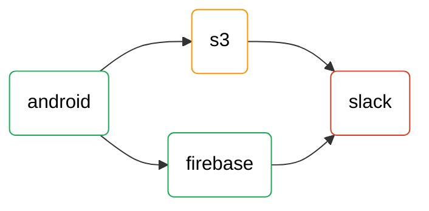
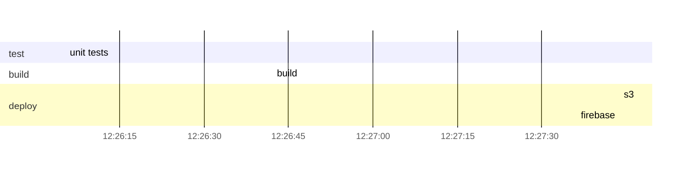
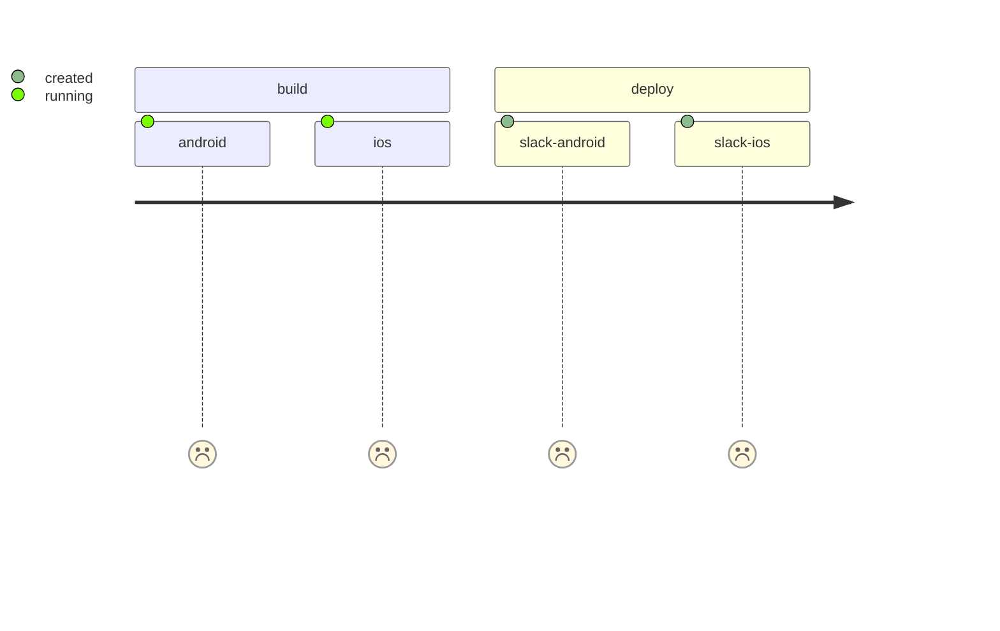

# Pipeline as mermaid

[](https://nov1kov.gitlab.io/pipeline_to_mermaid/)
[](https://badge.fury.io/py/pipeline-mermaid)
[](https://gitlab.com/user/project/pipelines)
[](https://opensource.org/licenses/MIT)


The useful tool to show Gitlab pipeline as mermaid

#### required environments

- `GITLAB_API_TOKEN` - gitlab api token

## Using

Show current pipeline in merge request notes. [Example merge request](https://gitlab.com/Nov1kov/pipeline_to_mermaid/-/merge_requests/4)

### in .gitlab-ci.yml

```yml
notify merge request:
  image: registry.gitlab.com/nov1kov/pipeline_to_mermaid:0.5
  stage: deploy
  only:
    - merge_requests
  script:
    - pipeline-mermaid show_current_pipeline
```

### as python package

#### install
```commandline
pip install pipeline-mermaid
```

show current pipeline in current merge request as gantt diagram
```commandline
pipeline-mermaid show_pipeline
```

show specific pipeline in specific merge request as gantt diagram
```commandline
pipeline-mermaid show_pipeline 249125838 gantt 3 
```

#### as python library

````python
from pipeline_mermaid.gitlab_helper import GitlabHelper

gl = GitlabHelper()
gl.show_pipeline(249125838, "gantt", 3)
````

## Gitlab pipeline as mermaid








# todo:

## gitlab 
- try depend on CI_JOB_TOKEN

### mermaid
- interactions https://mermaid-js.github.io/mermaid/diagrams-and-syntax-and-examples/gantt.html#interaction
- state

### documentaion
- https://pdoc3.github.io/pdoc/
- https://pydoc-markdown.readthedocs.io/en/latest/docs/api-documentation/processors/

### ci tools
- https://gitlab.version.fz-juelich.de/vis/jusense-cicd/-/wikis/discussion-on-howto-include-badges-in-gitlab-...
- https://github.com/jongracecox/anybadge
- https://docs.gitlab.com/ee/api/wikis.html
- gitlab release versions
- pylint (show errors in MR)