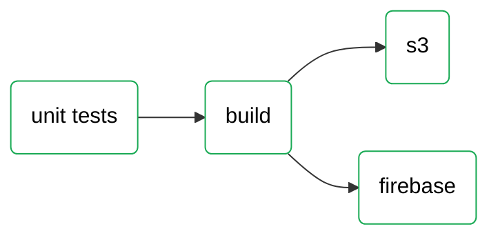
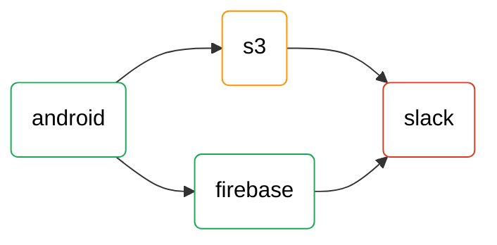
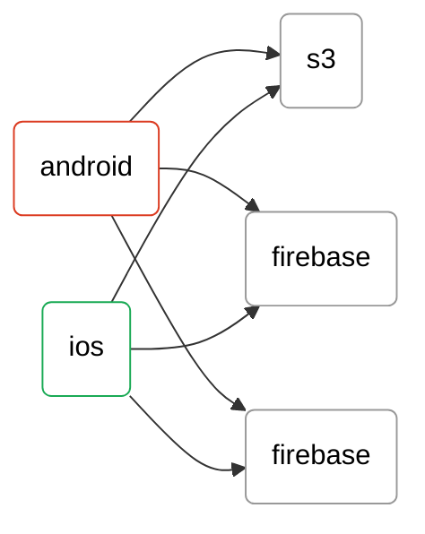

#### required environments

- `GITLAB_API_TOKEN` - gitlab api token

### Gitlab pipeline as graph LR

## todo:

### mermaid
- interactions https://mermaid-js.github.io/mermaid/diagrams-and-syntax-and-examples/gantt.html#interaction

### graph LR
- 'running'

### ci tools
- https://gitlab.version.fz-juelich.de/vis/jusense-cicd/-/wikis/discussion-on-howto-include-badges-in-gitlab-...
- https://github.com/jongracecox/anybadge
- https://docs.gitlab.com/ee/api/wikis.html