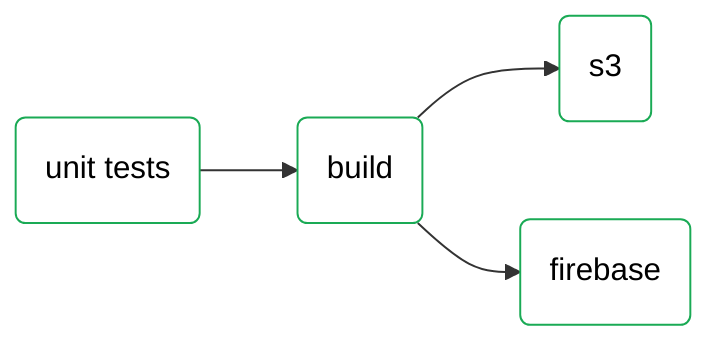
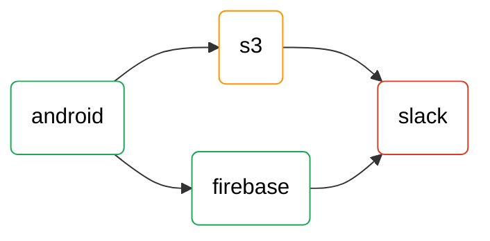
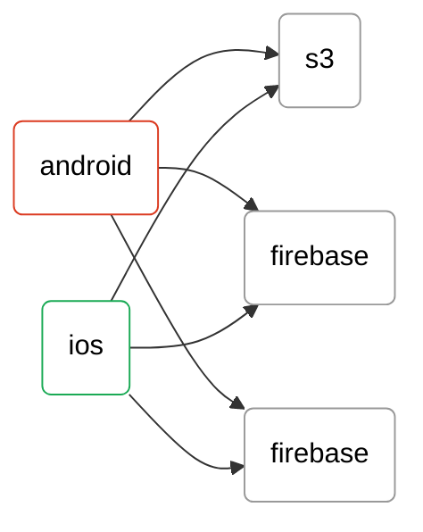
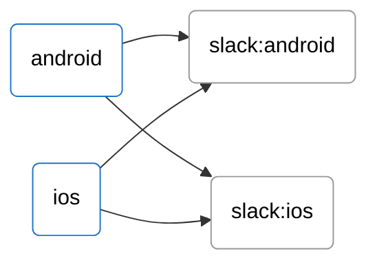
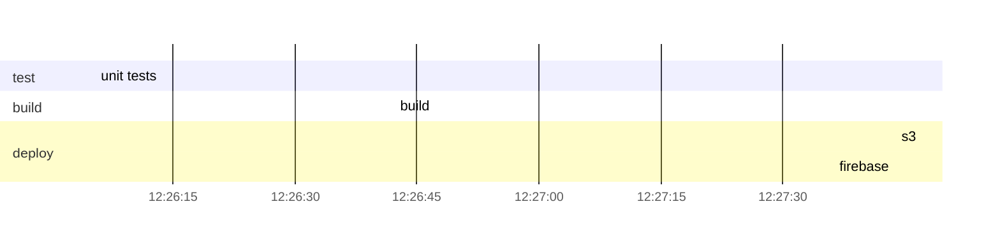
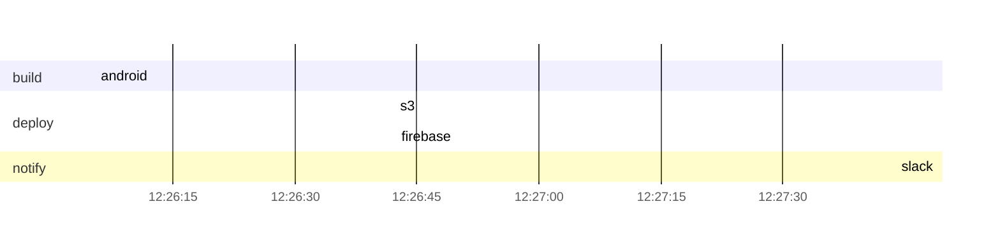
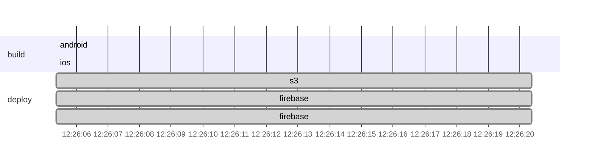

#### required environments

- `GITLAB_API_TOKEN` - gitlab api token


## Gitlab pipeline as graph LR











## Gitlab pipeline as gantt







```mermaid
gantt

dateFormat  YYYY-MM-DDTHH:mm:ss.SSSZ
axisFormat  %H:%M:%S

section build
android :active, 730991283, 15s
ios :active, 730991284, 15s

section deploy
slack-android :done, 730991285, after 730991283, 15s
slack-ios :done, 730991286, after 730991283, 15s
```

## todo:

### mermaid
- interactions https://mermaid-js.github.io/mermaid/diagrams-and-syntax-and-examples/gantt.html#interaction
- state

### ci tools
- https://gitlab.version.fz-juelich.de/vis/jusense-cicd/-/wikis/discussion-on-howto-include-badges-in-gitlab-...
- https://github.com/jongracecox/anybadge
- https://docs.gitlab.com/ee/api/wikis.html
- make python package