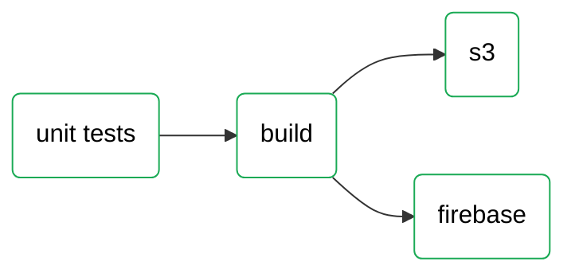

#### required environments

- `GITLAB_API_TOKEN` - gitlab api token

### Gitlab pipeline as graph LR

```mermaid
graph LR

classDef failed fill:white,stroke:#db3b21,color:black;
classDef success fill:white,stroke:#1aaa55,color:black;
classDef classWarn fill:white,stroke:#fc9403,color:black
classDef canceled fill:white,stroke:#999

730991283(unit tests)
730991284(build)
730991285(s3)
730991286(firebase)

730991283 --> 730991284
730991284 --> 730991285
730991284 --> 730991286

class 730991283 success
class 730991284 success
class 730991285 success
class 730991286 success
```