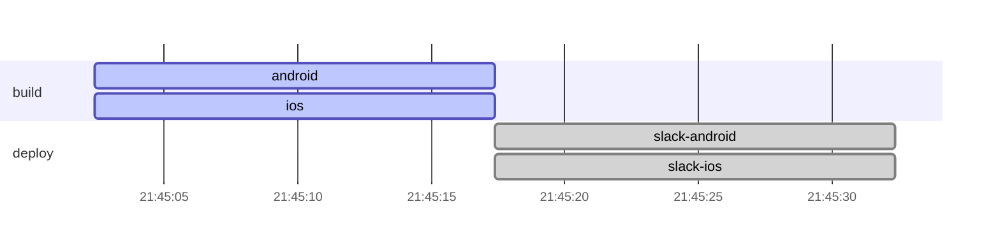
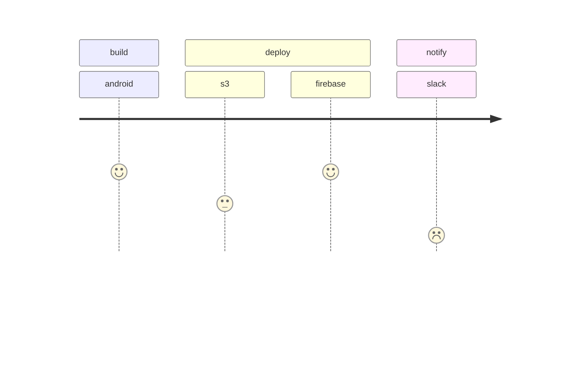
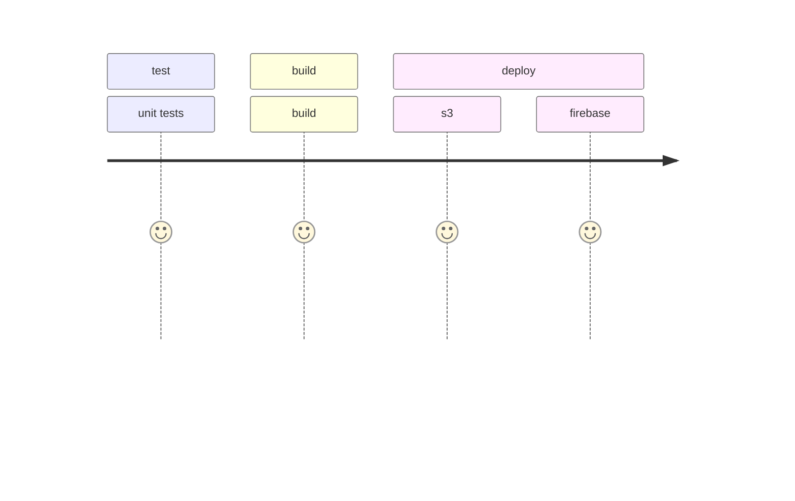
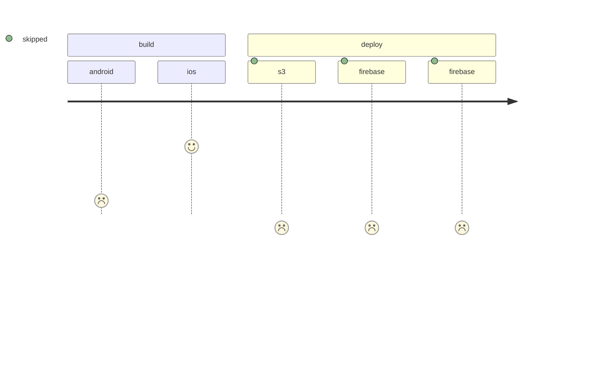

## Pipeline as mermaid

Useful tool to show Gitlab pipeline as mermaid

#### required environments

- `GITLAB_API_TOKEN` - gitlab api token

## Gitlab pipeline as graph LR

## Gitlab pipeline as gantt

## Gitlab pipeline as journey

## todo:

## gitlab 
- try depend on CI_JOB_TOKEN

### mermaid
- interactions https://mermaid-js.github.io/mermaid/diagrams-and-syntax-and-examples/gantt.html#interaction
- state
- journey

### documentaion
- https://pdoc3.github.io/pdoc/
- https://pydoc-markdown.readthedocs.io/en/latest/docs/api-documentation/processors/

### ci tools
- https://gitlab.version.fz-juelich.de/vis/jusense-cicd/-/wikis/discussion-on-howto-include-badges-in-gitlab-...
- https://github.com/jongracecox/anybadge
- https://docs.gitlab.com/ee/api/wikis.html
- gitlab release versions
- pylint (show errors in MR)